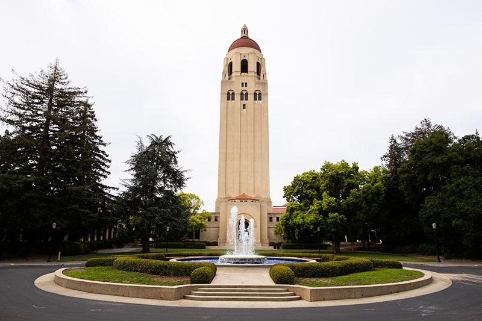
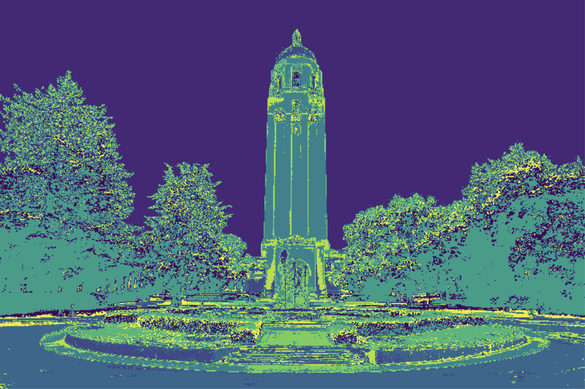
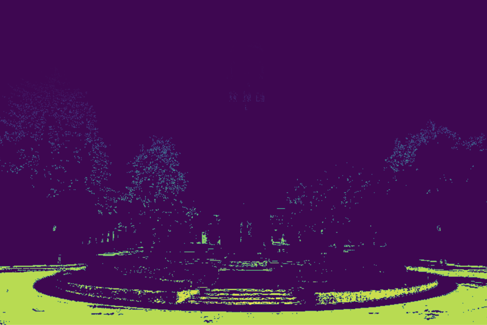
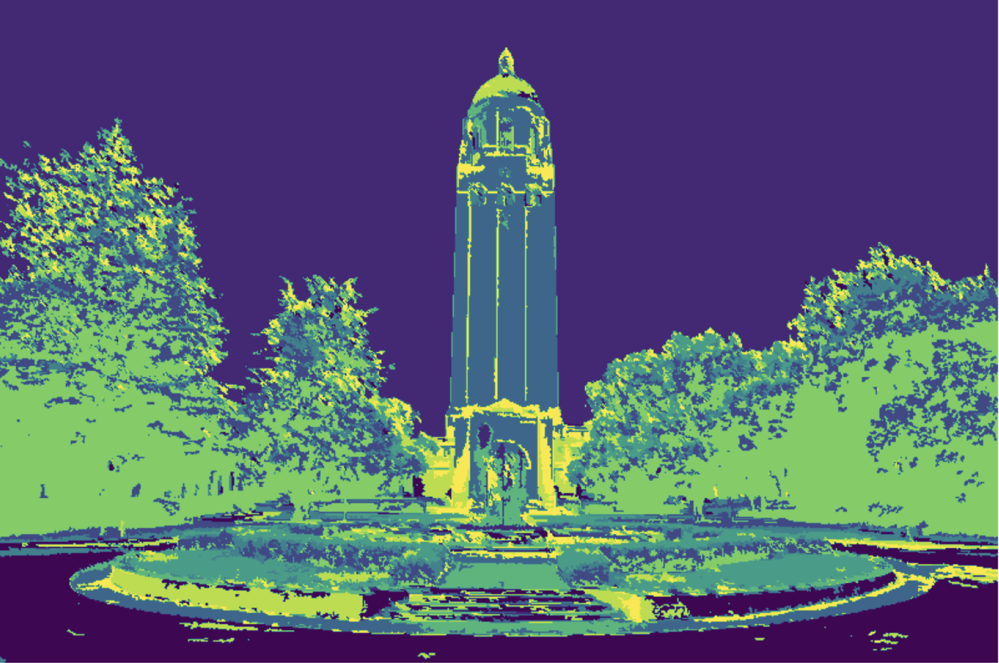
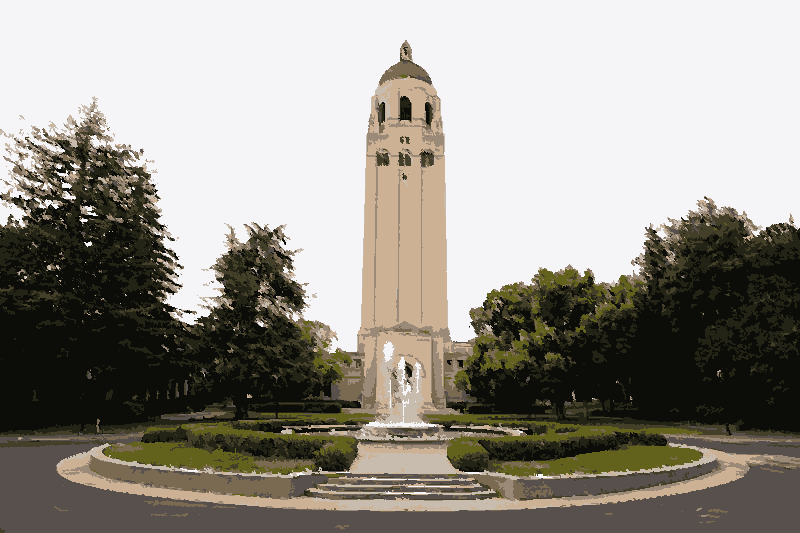
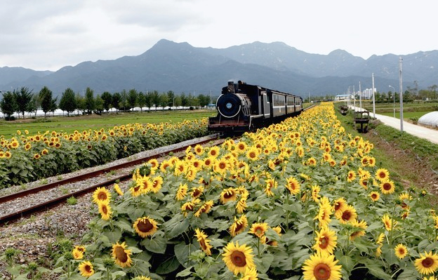
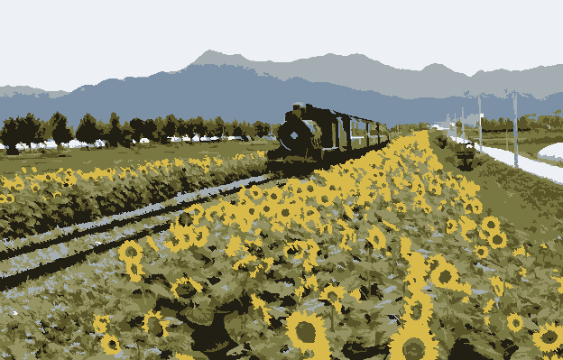

# Image Color Segmentation
This program produces cartoon-like renditions of images. It was made in python using Jupyter Notebook, NumPy, skimage, scipy, and matplotlib.

First, an image is passed in along with the number of colors the user would like to limit the output to. For this image, I limited the number of colors to 10.

Next, using kmeans clustering, the pixels in the images are split into 10 groups depending on how similar they are in color. Here, you see all of the different groups visualized as a different color. Notice how many of the regions are very small and not cohesively chunked together. 

Next, the algorithm goes through each of these 10 groups of pixels. Here is an example of one of these groups alone:

The algorithm then further divides this group of pixels into connected components--or areas of pixels that are touching each other. If a connected component has fewer pixels than a particular threshold, it will be absorbed by a nearby color. This gets rid of any small areas of a color. 

After all small regions of connected components are absorbed by nearby groups, cohesive chunks are formed. This is the raw output. 

Then, the average color of each of the 10 groups of pixels is found using their original color values. This average color is applied to every pixel in the group, giving the final output:

Here is another example of a converted image limited to 9 colors:

